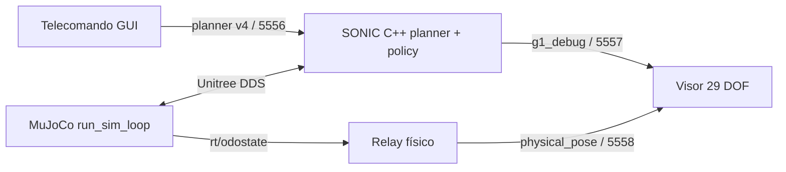

# Etapa 4: locomoción y brazos con NVIDIA GEAR-SONIC

*[English version](04-control-cuerpo-completo-sonic.md)*

## Objetivo

En esta etapa el Unitree G1 camina físicamente en MuJoCo con una política SONIC de
cuerpo completo y, desde un telecomando gráfico, puede mantener los brazos abajo,
adoptar una postura estable para cargar un objeto o acompañar la marcha con un
balanceo natural.

No se componen torques de dos controladores distintos. El telecomando envía velocidad
de base y objetivos de los 17 joints superiores al planner de SONIC; la misma policy
genera la acción coordinada de los 29 joints del cuerpo.

> **Alcance:** este módulo controla una simulación MuJoCo. No es una guía de despliegue
> sobre un G1 físico. Primero hay que validar límites, parada de emergencia y entorno
> para hardware real siguiendo la documentación oficial de NVIDIA y Unitree.

## Resultado validado

El caso se probó con una caminata acotada que produjo **0,833 m de desplazamiento
físico medido**. También se verificó visualmente la marcha con postura de carga y el
modo de brazos naturales. La posición global mostrada por el visor proviene de
`rt/odostate`, no de integrar la velocidad solicitada.

## Capturas de referencia

Las siguientes imágenes se agregan como referencia visual rápida para esta etapa.
Ambas fueron capturadas en el desktop Linux remoto validado `192.168.0.60` después
de levantar `run_sim_loop.py` sobre `DISPLAY=:0` y seleccionar el modo de brazos
`cargar` sin aplicar locomoción.


## Notas de captura y problemas encontrados

- Durante la captura remota apareció una condición de carrera en
  `gear_sonic/utils/mujoco_sim/unitree_sdk2py_bridge.py`: los subscribers DDS se
  inicializaban antes de crear `low_cmd_lock`, `left_hand_cmd_lock` y
  `right_hand_cmd_lock`. Si `LowCmdHandler` se dispara temprano, `run_sim_loop.py`
  aborta con `AttributeError: 'UnitreeSdk2Bridge' object has no attribute 'low_cmd_lock'`.
- La corrección práctica en el checkout de GR00T es crear esos tres locks antes de
  cualquier llamada a `ChannelSubscriber.Init(...)`.
- Cuando `run_sim_loop.py` se arranca por SSH hay que exportar `DISPLAY=:0`
  explícitamente; si no, GLFW termina con `X11: The DISPLAY environment variable is missing`.
- Antes de capturar, confirmar que el telecomando no esté publicando movimiento. Un
  teleop viejo todavía activo puede dejar la simulación caminando o caída aunque el
  visor ya esté abierto.
- En el entorno remoto validado, CycloneDDS todavía puede emitir warnings de
  inicialización de dominio `ChannelFactory` y el robot de MuJoCo puede terminar
  cayéndose más adelante en la sesión. Las capturas estables de arriba se tomaron
  inmediatamente después del arranque, antes de que reapareciera esa degradación.

## Qué incluye este repositorio

| Archivo | Responsabilidad |
|---|---|
| `sonic_remote_control.py` | Protocolo binario ZMQ v4 y cliente CLI. |
| `sonic_teleop.py` | Telecomando gráfico con dead man y modos de brazos. |
| `sonic_telemetry.py` | Decodificación de estado SONIC y odometría física. |
| `sonic_physical_pose_relay.py` | Relay DDS `rt/odostate` a ZMQ. |
| `sonic_viewer.py` | Visor del estado medido de 29 DOF, manos y base global. |
| `run_sonic_control.sh` | Launcher del cliente CLI. |
| `run_sonic_teleop.sh` | Launcher del telecomando local. |
| `run_sonic_remote.sh` | Arranque del ejecutable SONIC por SSH. |
| `run_sonic_viewer.sh` | Túneles SSH, relay y visor en macOS. |
| `run_sonic_linux_gui.sh` | Visor cuando todo corre en Linux. |
| `requirements-sonic.txt` | Dependencias ZMQ/MessagePack del módulo local. |
| `04-sonic-mujoco-physical-motion.patch` | Desactiva la banda elástica de upstream. |

Los checkpoints ONNX, el binario C++, Unitree SDK2 y el repositorio NVIDIA no se
redistribuyen aquí. Se instalan desde sus fuentes oficiales.

## Arquitectura



| Puerto | Emisor | Receptor | Contenido |
|---|---|---|---|
| `5556` | Telecomando | SONIC C++ | velocidad y objetivos superiores de 17 joints |
| `5557` | SONIC C++ | Visor | joints medidos, manos y objetivos |
| `5558` | Relay DDS | Visor | posición, orientación y velocidades físicas |

Los tres puertos usan TCP/ZMQ. DDS circula dentro del host Linux por `lo`.

## Requisitos

- Linux x86_64 con escritorio y GPU NVIDIA compatible con el stack SONIC.
- `git`, compilador C++ y dependencias indicadas por upstream.
- [NVlabs/GR00T-WholeBodyControl](https://github.com/NVlabs/GR00T-WholeBodyControl).
- Checkpoints [nvidia/GEAR-SONIC](https://huggingface.co/nvidia/GEAR-SONIC).
- Este repositorio clonado en la máquina desde la que se operará.
- Para operación remota: acceso SSH por clave PEM/privada y macOS con MuJoCo.

La ejecución validada usó upstream `021df73`, Python `3.10.20`, MuJoCo `3.10.0`,
PyZMQ `27.1.0` y msgpack `1.2.1` en Linux. Una revisión distinta puede cambiar el
protocolo o los paths; el protocolo esperado es **ZMQ v4, header de 1280 bytes**.

## Instalación en Linux

### 1. Preparar NVIDIA GR00T Whole-Body Control

```bash
git clone https://github.com/NVlabs/GR00T-WholeBodyControl.git
cd GR00T-WholeBodyControl
bash install_scripts/install_mujoco_sim.sh
```

El instalador crea `.venv_sim` con MuJoCo, Pinocchio y Unitree SDK2. No reemplazarlo
por el `.venv` de este repo.

### 2. Descargar la policy de baja latencia

```bash
source .venv_sim/bin/activate
python -m pip install huggingface_hub
python download_from_hf.py --low-latency
deactivate
```

Deben existir:

```text
gear_sonic_deploy/policy/low_latency/model_decoder.onnx
gear_sonic_deploy/policy/low_latency/model_encoder.onnx
gear_sonic_deploy/policy/low_latency/observation_config.yaml
gear_sonic_deploy/planner/target_vel/V2/planner_sonic.onnx
```

### 3. Compilar el deployment C++

```bash
cd gear_sonic_deploy
./scripts/install_deps.sh
just build
cd ..
```

Verificar que exista `gear_sonic_deploy/target/release/g1_deploy_onnx_ref`. Consultar
la documentación de upstream si `install_deps.sh` requiere privilegios o si la versión
actual cambió el build.

### 4. Instalar el módulo DAFO

Desde la raíz de `GR00T-WholeBodyControl`:

```bash
git clone https://github.com/gabgiani/DAFO-ROBOT-Research.git dafo-human-sonic
cp -R dafo-human-sonic/third_party/unitree_rl_gym/resources/robots/g1_description \
  dafo-human-sonic/model
.venv_sim/bin/pip install -r dafo-human-sonic/requirements-sonic.txt
```

El visor necesita `dafo-human-sonic/model/g1_29dof_with_hand_rev_1_0.xml` y los assets
referenciados por ese XML; por eso se copia la carpeta completa.

### 5. Liberar la base física

La configuración oficial habilita una banda elástica virtual que sostiene el torso.
Eso sirve para algunas pruebas, pero impide medir locomoción física libre. Aplicar el
patch incluido desde la raíz de upstream:

```bash
git apply --unidiff-zero --check dafo-human-sonic/workshop/04-sonic-mujoco-physical-motion.patch
git apply --unidiff-zero dafo-human-sonic/workshop/04-sonic-mujoco-physical-motion.patch
```

Si `--check` falla, **no forzar el patch**: comprobar la revisión upstream y adaptar
conscientemente las dos modificaciones. La inicialización de `elastic_band` evita un
`AttributeError` cuando la banda está desactivada.

### 6. Crear el directorio de motion requerido

El binario exige este argumento aunque el control activo venga del planner:

```bash
mkdir -p /tmp/sonic_smoke_motion
```

## Arranque completo en un desktop Linux

Abrir cuatro terminales desde `/home/USUARIO/GR00T-WholeBodyControl`.

**Terminal 1, física MuJoCo:**

```bash
.venv_sim/bin/python gear_sonic/scripts/run_sim_loop.py \
  --interface sim --enable-onscreen --no-enable-offscreen
```

**Terminal 2, policy SONIC:**

```bash
cd gear_sonic_deploy
target/release/g1_deploy_onnx_ref \
  lo policy/low_latency/model_decoder.onnx /tmp/sonic_smoke_motion \
  --planner-file planner/target_vel/V2/planner_sonic.onnx \
  --planner-precision 16 \
  --obs-config policy/low_latency/observation_config.yaml \
  --encoder-file policy/low_latency/model_encoder.onnx \
  --input-type zmq_manager --zmq-host 127.0.0.1 --zmq-port 5556 \
  --output-type all --disable-crc-check
```

**Terminal 3, odometría y visor:**

```bash
.venv_sim/bin/python dafo-human-sonic/sonic_physical_pose_relay.py &
SONIC_ROOT="$PWD" dafo-human-sonic/run_sonic_linux_gui.sh
```

**Terminal 4, telecomando:**

```bash
cd dafo-human-sonic
../.venv_sim/bin/python sonic_teleop.py --bind tcp://127.0.0.1:5556
```

El orden importa: simulador, policy, relay/visor y por último telecomando.

## Operación remota validada

Los launchers traen defaults para el laboratorio validado, pero todos los datos de
conexión se pueden sobrescribir; no hay que editar scripts ni hardcodear otra máquina.

En macOS:

```bash
cd /ruta/a/DAFO-ROBOT-Research
python3 -m venv .venv
.venv/bin/pip install -r requirements.txt -r requirements-sonic.txt
```

Primero iniciar `run_sim_loop.py` en el desktop Linux como en la Terminal 1. Después,
desde macOS, arrancar la policy remota:

```bash
export SONIC_SSH_KEY="$HOME/.ssh/mi-clave.pem"
export SONIC_SSH_HOST="usuario@host-linux"
export SONIC_REMOTE_ROOT="/ruta/a/GR00T-WholeBodyControl/gear_sonic_deploy"
./run_sonic_remote.sh
```

En otra terminal abrir el visor y los túneles:

```bash
export SONIC_SSH_KEY="$HOME/.ssh/mi-clave.pem"
export SONIC_SSH_HOST="usuario@host-linux"
export SONIC_REMOTE_ROOT="/ruta/a/GR00T-WholeBodyControl"
./run_sonic_viewer.sh
```

Y en una tercera terminal abrir el control:

```bash
./run_sonic_teleop.sh --bind tcp://127.0.0.1:5556
```

`run_sonic_viewer.sh` crea forwards para telemetría y odometría y un reverse forward
para control. La clave privada siempre se pasa con `-i`; no se usan contraseñas SSH.
La policy se inicia antes que el visor para que `5557` ya publique cuando venza su
timeout de conexión; ZMQ reintenta la conexión a `5556` hasta que aparezca el túnel.

## Uso del telecomando

1. Pulsar **Activar** y esperar el estado activo.
2. Mantener presionado un botón o tecla sólo mientras se desea mover. Al soltar, sale
   el comando de movimiento: éste es el dead man.
3. Pulsar **Detener** o `Espacio` antes de cambiar de modo o ventana.
4. Pulsar **Desactivar** al terminar.

| Acción | Teclas |
|---|---|
| Avanzar / retroceder | `W` / `S` o flechas arriba / abajo |
| Desplazamiento lateral | `Q` / `E` |
| Giro | `A` / `D` o flechas izquierda / derecha |
| Parar | `Espacio` |

La velocidad se limita entre `0,1` y `0,8 m/s`; empezar en `0,1 m/s` y aumentar sólo
después de comprobar estabilidad.

### Modos de brazos

- **Brazos abajo:** postura neutral y estable.
- **Cargar:** lleva ambos brazos al frente con codos flexionados para sostener una
  carga virtual. No simula contacto ni peso del objeto.
- **Caminar natural:** agrega un balanceo alternado dependiente de la marcha.

Las transiciones se limitan a `1,2 rad/s`. Incluso detenido se siguen publicando los
objetivos de brazo: enviar arrays de cero no equivale a liberar el control superior.

### Cliente de línea de comandos

Para automatizar una prueba acotada sin GUI:

```bash
./run_sonic_control.sh activate
./run_sonic_control.sh forward --speed 0.1 --duration 1.0
./run_sonic_control.sh stop
./run_sonic_control.sh deactivate
```

Cada invocación abre un publisher, ejecuta la acción y termina. Para operación manual
continua se recomienda el telecomando gráfico por su dead man visible.

## Verificación física

No validar locomoción sólo mirando la animación. Leer dos muestras de `physical_pose`
o usar `sonic_viewer.py` y comprobar que cambia la posición global. Para una prueba
segura:

1. Dejar espacio libre y velocidad en `0,1 m/s`.
2. Activar y mantener avance durante 1 segundo.
3. Soltar, pulsar **Detener** y anotar posición inicial/final.
4. Repetir con **Cargar** y luego **Caminar natural**.
5. Detener ante oscilación creciente, contacto inesperado o pérdida de telemetría.

## Parada segura

1. Soltar todas las teclas/botones.
2. Pulsar **Detener**.
3. Pulsar **Desactivar**.
4. Terminar el binario SONIC con `Ctrl+C`.
5. Terminar el relay y el simulador con `Ctrl+C`.

No usar un `pkill -f` amplio dentro del mismo comando SSH: el patrón puede coincidir
con el propio shell. Buscar el PID y terminar el proceso de forma explícita.

## Problemas encontrados y soluciones

### El robot anima las piernas pero no avanza físicamente

**Causa:** la banda elástica virtual aplica una fuerza externa al torso.

**Solución:** aplicar el patch incluido y verificar desplazamiento con odometría.

### El visor “avanza”, pero la simulación no

**Causa:** integrar la velocidad objetivo produce una pose estimada; no modifica la
física ni demuestra locomoción.

**Solución:** usar `rt/odostate` mediante el relay de `5558`. Los joints se toman de la
telemetría medida de SONIC y la base global de la odometría de MuJoCo.

### Combinar policy de piernas y PD de brazos hace caer al robot

**Causa:** una policy 12-DOF fue entrenada para otra masa, inercia y distribución de
actuadores. Sobrescribir motores superiores por DDS crea dos controladores que no se
coordinan.

**Solución:** usar una policy 29-DOF compatible y sus campos nativos
`upper_body_position[17]` y `upper_body_velocity[17]`. El intento anterior se conserva
en [FULL_BODY_INTEGRATION.es.md](../FULL_BODY_INTEGRATION.es.md) porque explica por qué
la composición ingenua no funciona.

### Los brazos saltan al cambiar de modo

**Causa:** cambiar instantáneamente los 17 targets genera una discontinuidad.

**Solución:** interpolación con límite de `1,2 rad/s` y publicación continua, también
en idle.

### La policy no recibe comandos

Comprobar que el telecomando está escuchando en `5556`, SONIC usa
`--input-type zmq_manager`, topic `pose` y protocolo v4. En remoto, comprobar el reverse
forward. `5557` debe pertenecer al ejecutable SONIC y `5558` al relay.

### `Address already in use`

Hay una instancia anterior. Identificar el PID con `ss -ltnp` en Linux o
`lsof -nP -iTCP:PUERTO` en macOS; detener sólo ese proceso y reiniciar en el orden
indicado.

### El viewer no carga el XML o falla con STL

Copiar todo `g1_description`, no sólo el XML: los meshes son rutas relativas. No usar
un decoder STL aislado como prueba definitiva; MuJoCo debe cargar la escena completa.

### El patch upstream no aplica

Se probó contra `021df73`. Revisar el diff de la versión instalada y reproducir sólo
la inicialización de `elastic_band` y `ENABLE_ELASTIC_BAND: False`. No aplicar con
`--reject` ni ignorar conflictos.

## Qué aprendimos

- Una animación o un viewer no reemplazan una medición física.
- La compatibilidad entre policy, observaciones y modelo mecánico es parte del control.
- Los brazos deben entrar por la interfaz soportada por el planner, no por un override
  de motores en paralelo.
- Un telecomando seguro necesita dead man, límites y transiciones suaves.
- Los primeros ensayos deben ser cortos, lentos y medidos numéricamente.

## Siguiente paso

Agregar un objeto dinámico con masa y contacto, estimar su pose y cerrar el lazo de
manipulación sin abandonar la interfaz de cuerpo completo de SONIC.