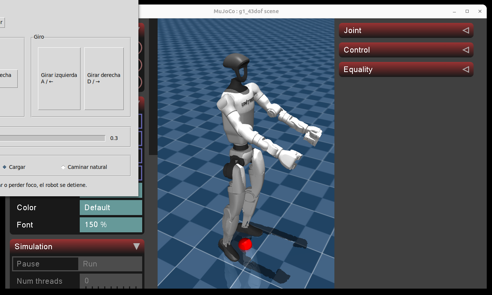
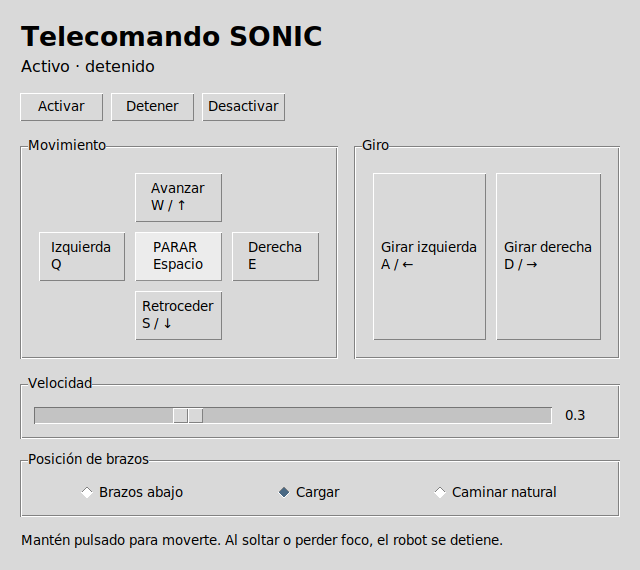
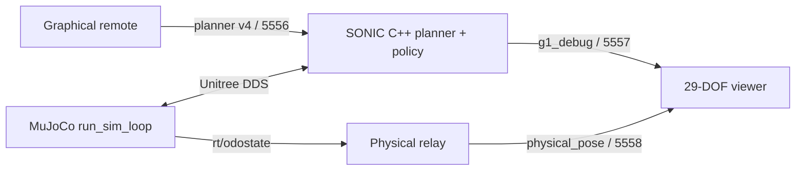

# Stage 4: locomotion and arms with NVIDIA GEAR-SONIC

*[Versión en español](04-control-cuerpo-completo-sonic.es.md)*

## Objective

In this stage, the Unitree G1 physically walks in MuJoCo with a whole-body SONIC policy.
A graphical remote control can keep the arms down, select a stable carrying posture,
or add a natural arm swing while walking.

The system does not combine torques from two independent controllers. The remote sends
base velocity and 17 upper-body joint targets to SONIC's planner; the same policy
produces the coordinated action for all 29 body joints.

> **Scope:** this module controls a MuJoCo simulation. It is not a deployment guide for
> a physical G1. Limits, emergency stops, and the operating area must be validated for
> real hardware using NVIDIA's and Unitree's official documentation.

## Validated result

The case was tested with a bounded walk that produced **0.833 m of measured physical
displacement**. Walking with the carrying posture and natural arm mode was also
visually verified. The global pose shown by the viewer comes from `rt/odostate`; it is
not obtained by integrating the requested velocity.

## Reference screenshots

The following images are included as quick visual references for this workshop. Both
were captured on the validated remote Linux desktop `192.168.0.60` after bringing up
`run_sim_loop.py` on `DISPLAY=:0` and selecting the `carry` arm mode without applying
locomotion input.





## Capture notes and issues found

- During the remote capture, `gear_sonic/utils/mujoco_sim/unitree_sdk2py_bridge.py`
  exposed a startup race: DDS subscribers were initialized before `low_cmd_lock`,
  `left_hand_cmd_lock`, and `right_hand_cmd_lock`. If `LowCmdHandler` fires early,
  `run_sim_loop.py` aborts with `AttributeError: 'UnitreeSdk2Bridge' object has no attribute 'low_cmd_lock'`.
- The practical fix in the GR00T checkout is to create those three locks before any
  `ChannelSubscriber.Init(...)` call.
- When `run_sim_loop.py` is started through SSH, `DISPLAY=:0` must be exported
  explicitly; otherwise GLFW exits with `X11: The DISPLAY environment variable is missing`.
- Before taking screenshots, confirm that the teleop is not publishing movement
  commands. A stale active teleop can leave the simulator walking or fallen even when
  the viewer is already open.
- In the validated remote environment, CycloneDDS can still emit `ChannelFactory`
  domain initialization warnings and the MuJoCo robot may fall later in the session.
  The stable screenshots above were taken immediately after startup, before that
  later degradation appeared again.

## What this repository includes

| File | Responsibility |
|---|---|
| `sonic_remote_control.py` | ZMQ v4 binary protocol and CLI client. |
| `sonic_teleop.py` | Graphical dead-man remote and arm modes. |
| `sonic_telemetry.py` | SONIC state and physical odometry decoding. |
| `sonic_physical_pose_relay.py` | DDS `rt/odostate` to ZMQ relay. |
| `sonic_viewer.py` | Viewer for measured 29-DOF, hands, and global-base state. |
| `run_sonic_control.sh` | CLI client launcher. |
| `run_sonic_teleop.sh` | Local remote-control launcher. |
| `run_sonic_remote.sh` | SONIC executable launcher over SSH. |
| `run_sonic_viewer.sh` | SSH tunnels, relay, and macOS viewer. |
| `run_sonic_linux_gui.sh` | Viewer when the entire stack runs on Linux. |
| `requirements-sonic.txt` | Local ZMQ/MessagePack dependencies. |
| `04-sonic-mujoco-physical-motion.patch` | Disables upstream's elastic band. |

The ONNX checkpoints, C++ binary, Unitree SDK2, and NVIDIA repository are not
redistributed here. Install them from their official sources.

## Architecture



| Port | Publisher | Consumer | Data |
|---|---|---|---|
| `5556` | Remote control | SONIC C++ | velocity and 17 upper-body joint targets |
| `5557` | SONIC C++ | Viewer | measured joints, hands, and targets |
| `5558` | DDS relay | Viewer | physical position, orientation, and velocities |

All three ports use TCP/ZMQ. DDS runs inside the Linux host over `lo`.

## Requirements

- x86_64 Linux with a desktop and an NVIDIA GPU supported by SONIC.
- `git`, a C++ compiler, and the dependencies required by upstream.
- [NVlabs/GR00T-WholeBodyControl](https://github.com/NVlabs/GR00T-WholeBodyControl).
- [nvidia/GEAR-SONIC](https://huggingface.co/nvidia/GEAR-SONIC) checkpoints.
- This repository cloned on the operating machine.
- For remote operation: SSH private/PEM-key access and macOS with MuJoCo.

The validated run used upstream `021df73`, Python `3.10.20`, MuJoCo `3.10.0`, PyZMQ
`27.1.0`, and msgpack `1.2.1` on Linux. A different revision may change protocol or
paths; this module expects **ZMQ v4 with a 1280-byte header**.

## Linux installation

### 1. Prepare NVIDIA GR00T Whole-Body Control

```bash
git clone https://github.com/NVlabs/GR00T-WholeBodyControl.git
cd GR00T-WholeBodyControl
bash install_scripts/install_mujoco_sim.sh
```

The installer creates `.venv_sim` with MuJoCo, Pinocchio, and Unitree SDK2. Do not
replace it with this repository's `.venv`.

### 2. Download the low-latency policy

```bash
source .venv_sim/bin/activate
python -m pip install huggingface_hub
python download_from_hf.py --low-latency
deactivate
```

These files must exist:

```text
gear_sonic_deploy/policy/low_latency/model_decoder.onnx
gear_sonic_deploy/policy/low_latency/model_encoder.onnx
gear_sonic_deploy/policy/low_latency/observation_config.yaml
gear_sonic_deploy/planner/target_vel/V2/planner_sonic.onnx
```

### 3. Build the C++ deployment

```bash
cd gear_sonic_deploy
./scripts/install_deps.sh
just build
cd ..
```

Verify that `gear_sonic_deploy/target/release/g1_deploy_onnx_ref` exists. Consult the
upstream documentation if `install_deps.sh` requires privileges or the current version
changed the build process.

### 4. Install the DAFO module

From the `GR00T-WholeBodyControl` root:

```bash
git clone https://github.com/gabgiani/DAFO-ROBOT-Research.git dafo-human-sonic
cp -R dafo-human-sonic/third_party/unitree_rl_gym/resources/robots/g1_description \
  dafo-human-sonic/model
.venv_sim/bin/pip install -r dafo-human-sonic/requirements-sonic.txt
```

The viewer needs `dafo-human-sonic/model/g1_29dof_with_hand_rev_1_0.xml` and all assets
referenced by that XML, which is why the entire directory is copied.

### 5. Release the physical base

The official configuration enables a virtual elastic band that supports the torso.
That helps some tests but prevents free physical locomotion measurements. Apply this
module's patch from the upstream root:

```bash
git apply --unidiff-zero --check dafo-human-sonic/workshop/04-sonic-mujoco-physical-motion.patch
git apply --unidiff-zero dafo-human-sonic/workshop/04-sonic-mujoco-physical-motion.patch
```

If `--check` fails, **do not force the patch**. Check the upstream revision and adapt
the two changes deliberately. Initializing `elastic_band` prevents an `AttributeError`
when the band is disabled.

### 6. Create the required motion directory

The binary requires this argument even when the planner is the active controller:

```bash
mkdir -p /tmp/sonic_smoke_motion
```

## Full startup on a Linux desktop

Open four terminals in `/home/USER/GR00T-WholeBodyControl`.

**Terminal 1, MuJoCo physics:**

```bash
.venv_sim/bin/python gear_sonic/scripts/run_sim_loop.py \
  --interface sim --enable-onscreen --no-enable-offscreen
```

**Terminal 2, SONIC policy:**

```bash
cd gear_sonic_deploy
target/release/g1_deploy_onnx_ref \
  lo policy/low_latency/model_decoder.onnx /tmp/sonic_smoke_motion \
  --planner-file planner/target_vel/V2/planner_sonic.onnx \
  --planner-precision 16 \
  --obs-config policy/low_latency/observation_config.yaml \
  --encoder-file policy/low_latency/model_encoder.onnx \
  --input-type zmq_manager --zmq-host 127.0.0.1 --zmq-port 5556 \
  --output-type all --disable-crc-check
```

**Terminal 3, odometry and viewer:**

```bash
.venv_sim/bin/python dafo-human-sonic/sonic_physical_pose_relay.py &
SONIC_ROOT="$PWD" dafo-human-sonic/run_sonic_linux_gui.sh
```

**Terminal 4, remote control:**

```bash
cd dafo-human-sonic
../.venv_sim/bin/python sonic_teleop.py --bind tcp://127.0.0.1:5556
```

Order matters: simulator, policy, relay/viewer, and remote control last.

## Validated remote workflow

The launchers contain defaults for the validated lab, but every connection value can
be overridden; do not edit scripts or hardcode a different machine.

On macOS:

```bash
cd /path/to/DAFO-ROBOT-Research
python3 -m venv .venv
.venv/bin/pip install -r requirements.txt -r requirements-sonic.txt
```

First start `run_sim_loop.py` on the Linux desktop as shown for Terminal 1. Then start
the remote policy from macOS:

```bash
export SONIC_SSH_KEY="$HOME/.ssh/my-key.pem"
export SONIC_SSH_HOST="user@linux-host"
export SONIC_REMOTE_ROOT="/path/to/GR00T-WholeBodyControl/gear_sonic_deploy"
./run_sonic_remote.sh
```

Open the viewer and tunnels in another terminal:

```bash
export SONIC_SSH_KEY="$HOME/.ssh/my-key.pem"
export SONIC_SSH_HOST="user@linux-host"
export SONIC_REMOTE_ROOT="/path/to/GR00T-WholeBodyControl"
./run_sonic_viewer.sh
```

Open the remote control in a third terminal:

```bash
./run_sonic_teleop.sh --bind tcp://127.0.0.1:5556
```

`run_sonic_viewer.sh` creates forward tunnels for telemetry and odometry and a reverse
forward for control. The private key is always passed with `-i`; SSH passwords are not
used. The policy starts before the viewer so `5557` is publishing before the viewer's
connection timeout; ZMQ retries the `5556` connection until the tunnel appears.

## Using the remote control

1. Press **Activar** and wait for active status.
2. Hold a button or key only while movement is desired. Releasing it removes the motion
   command: this is the dead-man behavior.
3. Press **Detener** or `Space` before changing modes or windows.
4. Press **Desactivar** when finished.

The labels remain in Spanish in the current UI:

| Action | Keys |
|---|---|
| Forward / backward | `W` / `S` or up / down arrows |
| Lateral movement | `Q` / `E` |
| Turn | `A` / `D` or left / right arrows |
| Stop | `Space` |

Speed is limited to `0.1` through `0.8 m/s`. Start at `0.1 m/s` and increase it only
after checking stability.

### Arm modes

- **Brazos abajo:** neutral, stable arm posture.
- **Cargar:** moves both arms forward with flexed elbows to hold a virtual load. It
  does not simulate object contact or weight.
- **Caminar natural:** adds alternating arm swing coupled to walking.

Transitions are limited to `1.2 rad/s`. Arm targets continue to be published while
idle: sending zero arrays is not equivalent to releasing upper-body control.

### Command-line client

To automate a bounded test without the GUI:

```bash
./run_sonic_control.sh activate
./run_sonic_control.sh forward --speed 0.1 --duration 1.0
./run_sonic_control.sh stop
./run_sonic_control.sh deactivate
```

Each invocation opens a publisher, performs the action, and exits. The graphical
remote is recommended for continuous manual operation because its dead-man state is
visible.

## Physical verification

Do not validate locomotion from animation alone. Read two `physical_pose` samples or
use `sonic_viewer.py` and verify that the global position changes. For a safe test:

1. Clear the area and select `0.1 m/s`.
2. Activate and hold forward for one second.
3. Release, press **Detener**, and record initial/final positions.
4. Repeat with **Cargar**, then **Caminar natural**.
5. Stop on growing oscillation, unexpected contact, or telemetry loss.

## Safe shutdown

1. Release every key/button.
2. Press **Detener**.
3. Press **Desactivar**.
4. Stop the SONIC binary with `Ctrl+C`.
5. Stop the relay and simulator with `Ctrl+C`.

Do not run a broad `pkill -f` inside the same SSH command: the pattern may match its
own shell. Find the PID and stop that process explicitly.

## Problems encountered and solutions

### The legs animate but the robot does not physically translate

**Cause:** the virtual elastic band applies an external force to the torso.

**Solution:** apply the included patch and verify displacement through odometry.

### The viewer “moves,” but the simulation does not

**Cause:** integrating requested velocity creates an estimated pose; it neither changes
physics nor proves locomotion.

**Solution:** consume `rt/odostate` through the `5558` relay. Joints come from measured
SONIC telemetry and the global base comes from MuJoCo odometry.

### Combining a leg policy with upper-body PD makes the robot fall

**Cause:** a 12-DOF policy was trained for a different mass, inertia, and actuator
distribution. Overriding upper motors through DDS creates two uncoordinated controllers.

**Solution:** use a compatible 29-DOF policy and its native
`upper_body_position[17]` and `upper_body_velocity[17]` fields. The earlier attempt is
preserved in [FULL_BODY_INTEGRATION.md](../FULL_BODY_INTEGRATION.md) because it explains
why naive composition fails.

### Arms jump when changing mode

**Cause:** switching all 17 targets instantly creates a discontinuity.

**Solution:** interpolate with a `1.2 rad/s` limit and publish continuously, including
idle frames.

### The policy receives no commands

Check that the remote is bound to `5556`, SONIC uses `--input-type zmq_manager`, topic
`pose`, and protocol v4. For remote operation, check the reverse forward. Port `5557`
must belong to SONIC and `5558` to the relay.

### `Address already in use`

A previous instance is running. Find its PID with `ss -ltnp` on Linux or
`lsof -nP -iTCP:PORT` on macOS, stop only that process, and restart in the documented
order.

### The viewer cannot load the XML or reports STL errors

Copy the entire `g1_description`, not only the XML; mesh paths are relative. Do not use
an isolated STL decoder as the final test: MuJoCo must load the complete scene.

### The upstream patch does not apply

It was tested against `021df73`. Review the installed version's diff and reproduce only
the `elastic_band` initialization and `ENABLE_ELASTIC_BAND: False`. Do not use
`--reject` or ignore conflicts.

## Lessons learned

- Animation and a viewer do not replace physical measurement.
- Policy, observations, and mechanical-model compatibility are part of the controller.
- Arms must enter through the planner's supported interface, not a parallel motor
  override.
- A safe remote needs dead-man behavior, limits, and smooth transitions.
- Initial trials should be short, slow, and measured numerically.

## Next step

Add a dynamic object with mass and contact, estimate its pose, and close the
manipulation loop without leaving SONIC's whole-body interface.